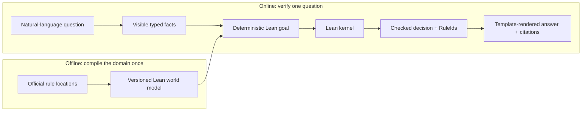

# Architecture

This is an independent teaching reconstruction of one public architectural
idea associated with Pramaana Labs. It does not reproduce Pramaana's private
implementation and is not affiliated with Pramaana Labs or Wishlink.

The public description separates an offline domain-formalization path from an
online verifier. This POC keeps that shape while reducing the domain to one
understandable Lean file.

## Trust boundary

The natural-language formalizer is untrusted. Before proof, its interpretation
must be visible as exactly three facts and the fixed assumptions. Missing or
uncertain information yields `UNKNOWN`.

The compiler is deterministic. It may emit a concrete Lean equality to check,
but it must never contain a second implementation of the tax calculation.
Lean's kernel is the checker. A failed proof is not automatically a refutation:
`REFUTED` requires a checked proof of an explicit opposite; otherwise the
status is `UNKNOWN`.

Each manual verification artifact contains the exact tiny Lean project snapshot
used for both passes. Its replay recipe is relative to that snapshot, so later
edits to the working repository cannot silently change the imported model.

The deterministic renderer consumes only a checked structured decision. It
maps the decision's checked `RuleId` values through the canonical, non-user-
selectable `sources.yaml`; changed citation content fails closed. No LLM writes
the answer, numbers, conclusion, or citations.

## Mapping to the public architecture

| Public architecture box | This repository |
|---|---|
| Domain knowledge | Two official source entries and four reviewed-as-experimental rule mappings |
| Domain formalizer | Human-authored, commented `Section194R.lean` in v0 |
| Symbolic world model | `CreatorCommerce/Section194R.lean` |
| Auto-formalizer | Untrusted strict-output extraction into a visible three-fact proposal |
| Facts + theorems | Concrete facts plus an equality against `assess` |
| Solver/prover | Lean reduction and kernel checking; no separate Z3 layer |
| Answer + proof | Checked `Decision`, including `RuleId` values |
| De-formalizer | Deterministic templates over the checked decision |

## Build order

1. **Done:** compile the tiny world model and handwritten example theorems.
2. **Done:** define one versioned JSON `FormalQuery` containing only the three
   facts, plus the adjacent untrusted-proposal and checked-result envelopes.
3. **Done:** deterministically generate a replayable Lean case theorem.
4. **Done:** run Lean twice: first to obtain its candidate `Decision`, then to
   kernel-check a concrete equality containing that decision. Preserve both
   Lean sources and both structured outputs.
5. **Done:** render a plain-English answer from checked fields and map only its
   checked `RuleId` values through the exact four-rule source map.
6. **Done:** add a constrained NL-to-`FormalQuery` proposal adapter. It uses a
   provider-only strict-output schema, then deterministically validates the
   public proposal and stops before Lean.
7. **Next:** add one local screen that requires confirmation before sending the
   exact proposed `FormalQuery` to the existing verifier.

A proposed feature belongs in v0 only if it makes one of these boxes visible
or executes the one supported question family. Everything else stays deferred.

## Reference

The architectural framing comes from Unbound's public write-up,
[Pramaana Labs - The Antithesis to AI Rollups](https://unbound-advisors.com/pramaana-labs-investment-thesis.html#summary),
especially its offline/online diagram and its statement that verification
operates inside a closed formal domain rather than guessing.
